<div align="center">
  
  
  # Nebula Dev
  
  ### Building Powerful Web Applications & Digital Solutions
  
  [](https://colinnebula.github.io/neb-media/)
  [](https://reactjs.org/)
  [](LICENSE)
  
</div>

---

## 📋 Table of Contents

- [About](#about)
- [Developer](#developer)
- [Features](#features)
- [Tech Stack](#tech-stack)
- [Featured Projects](#featured-projects)
- [Getting Started](#getting-started)
- [Available Scripts](#available-scripts)
- [Project Structure](#project-structure)
- [Deployment](#deployment)
- [Legal Documentation](#legal-documentation)
- [Contact](#contact)
- [License](#license)

---

## 🌟 About

**Nebula Dev** is a professional web development company specializing in creating powerful, scalable, and user-friendly web applications. We transform businesses through innovative digital solutions, exceptional UI/UX design, and cutting-edge technology.

Our portfolio website showcases our expertise, featured projects, tech stack, and comprehensive service offerings. Built with modern web technologies, it demonstrates our commitment to quality, performance, and user experience.

### 🎯 Mission
To deliver exceptional digital experiences that empower businesses to thrive in the modern digital landscape through innovation, quality craftsmanship, and client-focused solutions.

### 💡 Vision
To become a leading force in web development by continuously pushing the boundaries of what's possible with modern web technologies while maintaining the highest standards of code quality and user experience.

---

## 👨‍💻 Developer

### Colin Nebula
**Full-Stack Developer & Founder**

Colin Nebula is a passionate and innovative full-stack developer with expertise in modern web technologies. With a strong foundation in both frontend and backend development, Colin specializes in creating scalable, performant applications that solve real-world problems.

#### Expertise:
- **Frontend Development**: React, TypeScript, Next.js, React Native
- **Backend Development**: Node.js, Express, Django, Flask
- **Databases**: PostgreSQL, MongoDB, MySQL, Redis
- **Cloud & DevOps**: AWS, Docker, Kubernetes, CI/CD
- **Mobile Development**: React Native, Flutter, Swift
- **UI/UX Design**: Figma, Adobe XD, Responsive Design

#### Connect:
- **Email**: colin@nebuladev.com
- **GitHub**: [@ColinNebula](https://github.com/ColinNebula)
- **LinkedIn**: [Colin Nebula](https://linkedin.com/in/colinnebula)
- **Portfolio**: [nebuladev.com](https://colinnebula.github.io/neb-media/)

---

## ✨ Features

### 🎨 Modern UI/UX
- **Glass-morphism Design**: Sleek, modern interface with frosted glass effects
- **Dark/Light Theme**: Fully integrated theme switching system
- **Responsive Layout**: Optimized for all devices (mobile, tablet, desktop)
- **Smooth Animations**: CSS animations and transitions for enhanced UX
- **Interactive Elements**: Hover effects, ripple animations, and dynamic content

### 🚀 Core Functionality
- **Portfolio Showcase**: Featured projects with detailed descriptions
- **Service Catalog**: Comprehensive service offerings and capabilities
- **Tech Stack Display**: Interactive technology showcase with proficiency levels
- **Contact System**: Professional contact form with validation
- **Modal Systems**: Get Started and Technologies modals
- **Authentication**: Login/Register system (coming soon)

### 📱 Featured Sections
1. **Dashboard**: Hero section, stats, services, testimonials
2. **About**: Company info, team, values, technologies
3. **Portfolio**: Featured applications and projects
4. **Contact**: Contact form, business information, map integration
5. **Legal**: Privacy Policy, Terms of Service, Cookie Policy

### 🔒 Legal Compliance
- Comprehensive Privacy Policy (11 sections)
- Detailed Terms of Service (12 sections)
- Cookie Policy with management options
- GDPR and data protection compliance

---

## 🛠 Tech Stack

### Frontend
```
React 18.2.0          - UI Library
React Bootstrap 5.1.3 - Component Framework
React Icons           - Icon Library
CSS3                  - Styling & Animations
JavaScript (ES6+)     - Programming Language
```

### Backend & Tools
```
Node.js               - Runtime Environment
npm                   - Package Manager
Git                   - Version Control
GitHub Pages          - Hosting & Deployment
```

### Development Tools
```
VS Code               - Code Editor
ESLint                - Code Linting
Prettier              - Code Formatting
Chrome DevTools       - Debugging
```

### Featured Libraries
- **react-bootstrap**: UI components and layout system
- **react-icons**: Comprehensive icon set (FontAwesome)
- **react-router-dom**: Client-side routing (planned)
- **axios**: HTTP client for API requests (planned)

---

## 🎯 Featured Projects

### 1. Screen Capture App
**Real-time screen recording and streaming solution**
- 🎥 Multi-platform screen capture
- 📹 Live streaming capabilities
- 💾 Local and cloud storage
- **Tech**: React, WebRTC, Electron, AWS S3

### 2. Nebula Media Platform
**Comprehensive media management and streaming**
- 🎬 Video hosting and streaming
- 📊 Analytics dashboard
- 👥 User management system
- **Tech**: React, Node.js, MongoDB, FFmpeg

### 3. Nebula VPN Client
**Secure and private internet browsing**
- 🔒 Military-grade encryption
- 🌍 Global server network
- ⚡ Ultra-fast connections
- **Tech**: React Native, OpenVPN, Express

### 4. Quibish Game Platform
**Multiplayer gaming experience**
- 🎮 Real-time multiplayer
- 🏆 Leaderboards and achievements
- 💬 In-game chat system
- **Tech**: React, Socket.io, Redis, PostgreSQL

---

## 🚀 Getting Started

### Prerequisites
- **Node.js** (v14 or higher)
- **npm** (v6 or higher)
- **Git**

### Installation

1. **Clone the repository**
   ```bash
   git clone https://github.com/ColinNebula/neb-media.git
   cd neb-media
   ```

2. **Install dependencies**
   ```bash
   npm install
   ```

3. **Start the development server**
   ```bash
   npm start
   ```

4. **Open your browser**
   ```
   Navigate to http://localhost:3000
   ```

The app will automatically reload when you make changes. Check the console for any lint errors.

---

## 📜 Available Scripts

### `npm start`
Runs the app in development mode at [http://localhost:3000](http://localhost:3000).
- Hot module reloading enabled
- Displays lint errors in console
- Opens browser automatically

### `npm test`
Launches the test runner in interactive watch mode.
- Runs unit and integration tests
- Displays coverage reports
- Watch mode for continuous testing

### `npm run build`
Builds the app for production to the `build` folder.
- Optimized React production build
- Minified and hashed filenames
- Ready for deployment
- Performance optimized

### `npm run deploy`
Deploys the app to GitHub Pages.
- Builds production bundle
- Pushes to gh-pages branch
- Updates live site automatically

### `npm run eject`
**⚠️ Warning: This is a one-way operation!**

Ejects from Create React App, giving you full control over configuration files (webpack, Babel, ESLint, etc.). Only use if you need advanced customization.

---

## 📁 Project Structure

```
neb-media/
├── public/
│   ├── index.html              # HTML template
│   ├── favicon.ico             # Site favicon
│   ├── manifest.json           # PWA manifest
│   └── icons/                  # Icon library
│
├── src/
│   ├── assets/
│   │   └── images/             # Images and logos
│   │       ├── nebula-dev-logo.svg
│   │       ├── nebula-dev-logo-horizontal.svg
│   │       ├── hero.png
│   │       ├── byte.png
│   │       └── rider.png
│   │
│   ├── components/
│   │   ├── Dashboard/          # Main dashboard component
│   │   ├── About/              # About page
│   │   ├── Contact/            # Contact form
│   │   ├── Footer/             # Site footer
│   │   ├── SideNav/            # Navigation component
│   │   ├── AuthModal/          # Authentication modal
│   │   ├── Privacy Policy/     # Privacy policy page
│   │   ├── Terms of Service/   # Terms of service page
│   │   └── Cookie Policy/      # Cookie policy page
│   │
│   ├── contexts/
│   │   └── ThemeContext.js     # Theme management
│   │
│   ├── services/
│   │   └── api.js              # API service layer
│   │
│   ├── App.js                  # Main app component
│   ├── App.css                 # App-specific styles
│   ├── index.js                # Entry point
│   ├── index.css               # Global styles
│   └── setupTests.js           # Test configuration
│
├── build/                      # Production build (generated)
├── package.json                # Dependencies and scripts
├── README.md                   # This file
└── .gitignore                  # Git ignore rules
```

---

## 🌐 Deployment

### GitHub Pages (Current)

The site is currently deployed on GitHub Pages:
- **URL**: https://colinnebula.github.io/neb-media/
- **Branch**: gh-pages
- **Auto-deployment**: Via `npm run deploy`

### Deployment Steps

1. **Build the production bundle**
   ```bash
   npm run build
   ```

2. **Deploy to GitHub Pages**
   ```bash
   npm run deploy
   ```

3. **Verify deployment**
   - Check the live URL
   - Test all features and links
   - Verify responsive design

### Alternative Deployment Options

- **Vercel**: Zero-config deployment with CI/CD
- **Netlify**: Continuous deployment from Git
- **AWS S3**: Static site hosting with CloudFront CDN
- **Heroku**: Node.js app deployment

---

## 📄 Legal Documentation

Nebula Dev maintains comprehensive legal documentation to ensure transparency and compliance:

### Privacy Policy
**11 comprehensive sections covering:**
- Information collection and usage
- Data sharing and security
- User rights and choices
- Cookie usage and tracking
- International data transfers
- Children's privacy
- Policy updates and contact information

[View Privacy Policy](https://colinnebula.github.io/neb-media/#privacy-policy)

### Terms of Service
**12 detailed sections including:**
- Service acceptance and usage
- Client obligations and responsibilities
- Payment terms (50/25/25 structure)
- Intellectual property rights
- Confidentiality agreements
- Warranties and liability limitations
- Dispute resolution and termination
- General legal provisions

[View Terms of Service](https://colinnebula.github.io/neb-media/#terms-of-service)

### Cookie Policy
**Comprehensive cookie management covering:**
- 4 cookie type categories (Essential, Functional, Analytics, Performance)
- Detailed cookie listings with purposes and durations
- Browser-specific management instructions
- Third-party cookie information
- Security measures and data retention
- User control and preferences

[View Cookie Policy](https://colinnebula.github.io/neb-media/#cookie-policy)

---

## 📞 Contact

### Nebula Dev

**Email**: info@nebuladev.com  
**Phone**: +1 (416) 856-4567  
**Address**: 46 Wildfire Road, Woodbridge, ON L4L 8Y9

### Business Inquiries
For project inquiries, partnerships, or consultations:
- **Email**: hello@nebuladev.com
- **Contact Form**: [Submit via website](https://colinnebula.github.io/neb-media/#contact)

### Technical Support
For technical issues or support:
- **Email**: support@nebuladev.com

### Legal & Privacy
For privacy, legal, or compliance questions:
- **Email**: legal@nebuladev.com
- **Privacy Officer**: privacy@nebuladev.com

---

## 🤝 Contributing

We welcome contributions from the community! Here's how you can help:

### Reporting Bugs
1. Check existing issues to avoid duplicates
2. Create a detailed bug report with:
   - Steps to reproduce
   - Expected vs actual behavior
   - Screenshots (if applicable)
   - Browser and OS information

### Suggesting Features
1. Open an issue with the `feature request` label
2. Describe the feature and its benefits
3. Provide examples or mockups if possible

### Code Contributions
1. Fork the repository
2. Create a feature branch (`git checkout -b feature/AmazingFeature`)
3. Commit your changes (`git commit -m 'Add AmazingFeature'`)
4. Push to the branch (`git push origin feature/AmazingFeature`)
5. Open a Pull Request

### Code Style Guidelines
- Follow ESLint configuration
- Use meaningful variable/function names
- Write clear comments for complex logic
- Maintain consistent formatting (Prettier)
- Test your changes before submitting

---

## 📊 Performance & SEO

### Performance Optimizations
- **Code splitting**: Lazy loading for components
- **Image optimization**: Compressed and properly sized assets
- **Minification**: Production builds are fully minified
- **Caching**: Browser caching for static assets
- **CDN**: Fast content delivery via GitHub Pages

### SEO Features
- **Meta tags**: Comprehensive meta descriptions
- **Semantic HTML**: Proper heading hierarchy
- **Mobile-friendly**: Responsive design for all devices
- **Fast loading**: Optimized bundle sizes
- **Accessibility**: ARIA labels and keyboard navigation

---

## 🔒 Security

### Security Measures
- **HTTPS**: Secure connections only
- **Input validation**: Form validation and sanitization
- **Cookie security**: HttpOnly and SameSite attributes
- **CORS policies**: Proper cross-origin configurations
- **Regular updates**: Dependencies kept up-to-date

### Reporting Security Issues
If you discover a security vulnerability:
1. **DO NOT** create a public issue
2. Email security@nebuladev.com with details
3. Include steps to reproduce (if applicable)
4. We'll respond within 48 hours

---

## 📈 Roadmap

### Q4 2025
- [ ] Enhanced portfolio showcase with project details
- [ ] Blog system with technical articles
- [ ] Client testimonials and case studies
- [ ] Advanced contact form with file uploads
- [ ] Newsletter subscription system

### Q1 2026
- [ ] Full authentication system
- [ ] User dashboard with project tracking
- [ ] Payment integration for services
- [ ] Live chat support
- [ ] Multi-language support (i18n)

### Q2 2026
- [ ] Mobile app (React Native)
- [ ] API documentation portal
- [ ] Developer resources section
- [ ] Community forum
- [ ] Webinar and events system

---

## 🎓 Learning Resources

Built with modern web technologies. Here are some resources:

- [React Documentation](https://reactjs.org/)
- [React Bootstrap](https://react-bootstrap.github.io/)
- [Create React App](https://create-react-app.dev/)
- [MDN Web Docs](https://developer.mozilla.org/)
- [Web.dev](https://web.dev/)

---

## 📝 License

This project is licensed under the **MIT License** - see the [LICENSE](LICENSE) file for details.

```
MIT License

Copyright (c) 2025 Nebula Dev - Colin Nebula

Permission is hereby granted, free of charge, to any person obtaining a copy
of this software and associated documentation files (the "Software"), to deal
in the Software without restriction, including without limitation the rights
to use, copy, modify, merge, publish, distribute, sublicense, and/or sell
copies of the Software, and to permit persons to whom the Software is
furnished to do so, subject to the following conditions:

The above copyright notice and this permission notice shall be included in all
copies or substantial portions of the Software.
```

---

## 🙏 Acknowledgments

- **React Team**: For the amazing React framework
- **Bootstrap Team**: For the comprehensive component library
- **Open Source Community**: For countless tools and libraries
- **GitHub**: For hosting and deployment services
- **Clients & Partners**: For trust and collaboration

---

## 📱 Social Media

Stay connected with Nebula Dev:

- **LinkedIn**: [Nebula Dev Company](https://linkedin.com/company/nebuladev)
- **Twitter**: [@NebulaDev](https://twitter.com/nebuladev)
- **Instagram**: [@nebuladev](https://instagram.com/nebuladev)
- **YouTube**: [Nebula Dev Channel](https://youtube.com/@nebuladev)
- **Facebook**: [Nebula Dev](https://facebook.com/nebuladev)

---

<div align="center">
  
  ### Made with ❤️ by Colin Nebula
  
  **Nebula Dev** © 2025 - Building the Future, One Line of Code at a Time
  
  ⭐ Star this repo if you find it helpful!
  
  [Website](https://colinnebula.github.io/neb-media/) • [Email](mailto:colin@nebuladev.com) • [GitHub](https://github.com/ColinNebula)
  
</div>
